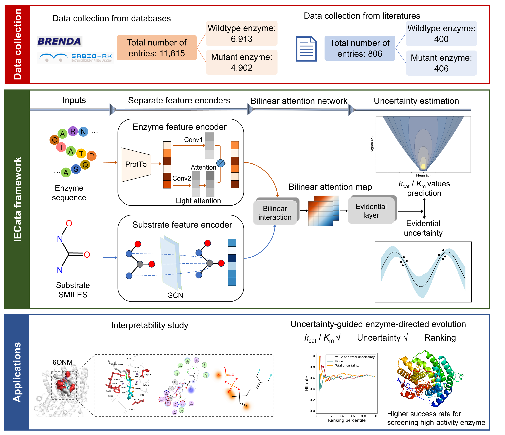

# IECata: Interpretable bilinear attention network and evidential deep learning improve the catalytic efficiency prediction of enzymes 

## Introduction
This repository contains the PyTorch implementation of **IECata** framework, as described in paper
 "IECata: Interpretable bilinear attention network and evidential deep learning improve the catalytic efficiency prediction of enzymes".  
 We also provide online prediction tools where users can access [http://mathtc.nscc-tj.cn/cataai/](http://mathtc.nscc-tj.cn/cataai/) for direct prediction.

## Framework

## catalogue

- [Installation](#Installation)
- [Dataset](#Dataset)
- [Train](#Train)
- [Prediction](#Prediction)
- [License](#License)

## Installation
The source code developed in Python 3.8 using PyTorch 1.12.0. 
we recommend using a virtual conda
 environment as enviroment management for the installation of 
 IECata and its dependencies. 
 The virtual environment can be created as follows:
```bash
conda create -n iecata python==3.8
conda activate iecata
```
Download the source code of IECata from GitHub:
```bash
git clone https://github.com/zhaoyanpeng208/IECata.git
```
Install IECata dependencies as following, this will take about one to two hours.:
```bash
conda env create -f environment.yaml
```
The required python dependencies are given below.
```
torch=1.12.0
dgl=1.1.1.cu113
dgllife==0.2.8
torch-cluster=1.6.0+pt112cu113
torch-geometric==2.2.0
torch-scatter=2.1.0+pt112cu113
torch-sparse=0.6.14
torch-spline-conv=1.2.1+pt112cu113
torchmetrics==1.2.1
numpy=1.24.3
scikit-learn=1.2.2
pandas=2.0.3
prettytable=3.10.0
rdkit=2020.09.1
yacs=0.1.8
transformers=4.32.1
```


## Datasets
The `datasets` folder contains all experimental data used in IECata. 
The datasets are stored in the `datasets/kcatkm/train` folder, 
and the datasets, validation sets and test sets have been 
divided in 8:1:1 ratio (random seed=100 ).  
The independent test set is stored in `datasets/independent_test`
and contains 806 samples from the literature collection.


## Train
To train IECata, where we provide the
 basic configurations for all hyperparameters in config.py. 
```bash
python main.py --cfg configs/IECata.yaml --data kcatkm
```
The training results are saved in the folder`./result/train`. 
If you want to change the folder, you can change `IECata.yaml`
## Prediction
Model parameters can be found under the result folder.
It takes about 5 minutes to run a test on the Kcatkm testset
 (1183 samples) and output the results.
```bash 
python independent_test_attention.py --cfg configs/independent_test.yaml --data independent_test 
```
After predicting with your well trained model, 
the predicting output will be saved in "result" dictory.  
If you want to specify the output folder, you can change
 the `independent_test.yaml`.
 
## License
This project is covered under the Apache 2.0 License.


